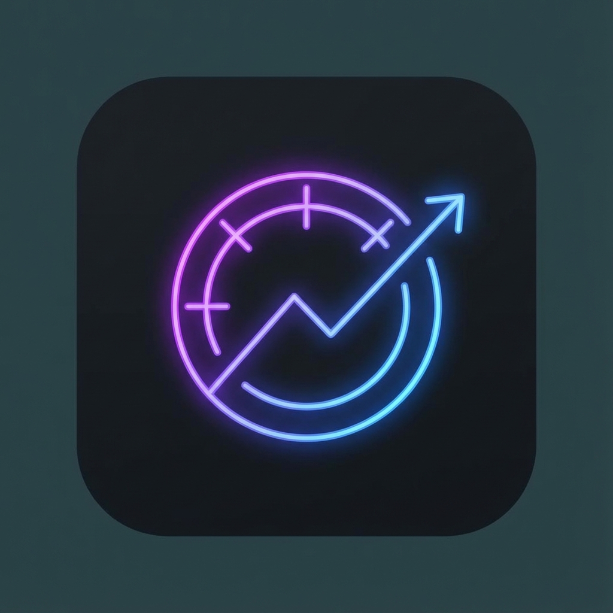

<div align="center">
    
</div>

<div align="center">
    <!-- Version -->
    <a href="https://marketplace.visualstudio.com/items?itemName=Zendevve.antigravity-usage">
        
    </a>
    <!-- Installs -->
    <a href="https://marketplace.visualstudio.com/items?itemName=Zendevve.antigravity-usage">
        
    </a>
    <!-- License -->
    <a href="./LICENSE">
        
    </a>
    <!-- PRG Badge: Gold (Self-assigned based on product maturity) -->
    <a href="./README.md">
         
    </a>
</div>

<div align="center">
    <h3>Antigravity Usage</h3>
    <p>Premium AI usage dashboard for AntiGravity with burn rate tracking, exhaustion predictions, and beautiful insights.</p>
</div>

--------------------------------------------------------------------------------

## Table of Contents

- [Features](#features)
- [Background Story](#background-story)
- [Getting Started](#getting-started)
- [Configuration](#configuration)
- [What's Inside?](#whats-inside)
- [Resources](#resources)
- [License](#license)
- [Credits](#credits)

## Features

**Antigravity Usage** redefines how you monitor your AI consumption. Built for power users who need clarity, prediction, and aesthetics.

- **Real-Time Dashboards**: A unified Sidebar and Full-Screen Dashboard monitoring all your quotas in real-time.
- **Insights Engine**: Advanced analytics including *Session Burn Rate* and *Predicted Exhaustion* times.
- **Visual Intelligence**:
  - **Laws of UX Compliance**: Designed using Miller's Law (chunking), Von Restorff Effect (critical alerts), and Aesthetic-Usability Effect.
  - **Status Indicators**: Dynamic color-coded bars and badges for instant health checks.
- **Zero Config**: Automatically detects your local Antigravity server ports.
- **Platform Agnostic**: Works perfectly on Windows and macOS.

## Background Story

Managing AI quotas shouldn't feel like managing a spreadsheet. I built **Antigravity Usage** to bring a layer of "Premium Utility" to the developer workflow. By leveraging modern design principles and a reactive state architecture, this extension transforms raw JSON data into actionable, beautiful insights, keeping you in flow without the anxiety of hitting sudden limits.

## Getting Started

### Installation

1. Open **VS Code**.
2. Press `Ctrl+P` and type `ext install Zendevve.antigravity-usage`.
3. The extension automatically activates when it detects an active Antigravity session.

### Usage

- **Status Bar**: Click the "AG" status bar item to open the Quick Sidebar.
- **Sidebar**: View your primary model's health at a glance.
- **Dashboard**: Click "Open Dashboard" for deep analytics, charts, and historical trends.
- **Commands**:
  - `Antigravity: Refresh Quota` - Force a manual update.
  - `Antigravity: Open Dashboard` - Launch the full analytics view.
  - `Antigravity: Clear History` - Reset your session stats.

## Configuration

Customize your experience in `Settings > Extensions > Antigravity Usage`.

| Setting | Description | Default |
| :--- | :--- | :--- |
| `antigravity.refreshInterval` | Polling frequency in milliseconds. | `3000` |
| `antigravity.warningThreshold` | Percentage at which the status bar turns yellow/red. | `10` |
| `antigravity.displayStyle` | visual formatting of status bar (`percentage`, `fraction`, `icon`). | `percentage` |
| `antigravity.pinnedModels` | List of models to keep at the top of your capabilities list. | `[]` |

## What's Inside?

```bash
├── docs/                # Feature specs, ADRs, and guides
│   ├── ADR/             # Architecture Decision Records
│   └── Features/        # Deep dive into functionality
├── src/                 # Source Code
│   ├── core/            # Business Logic (Store, Fetcher, Insights)
│   ├── ui/              # UI Components (Renderer, Tokens)
│   └── utils/           # Formatters and Helpers
├── legacy/              # Archived V1 codebase
└── package.json         # Manifest and Configuration
```

## Resources

This project leverages the following powerful libraries:

- [VS Code Extension API](https://code.visualstudio.com/api) - The framework for integration.
- [TypeScript](https://www.typescriptlang.org/) - For strict type safety and architectural robustness.
- [Redux Pattern](https://redux.js.org/) - Inspired the internal `QuotaStore` design.

## License

This project is licensed under the **MIT License**.

- **Why MIT?** I believe tools like this should be open and accessible. You are free to fork, modify, and improve this dashboard.

See the [LICENSE](./LICENSE) file for details.

--------------------------------------------------------------------------------

## Credits

### Creator

**Zendevve**
- [GitHub Profile](https://github.com/Zendevve)

### Tools

Built with **MCAF** (Managed Code Coding AI Framework).

<div align="center">
    <hr>
    <a href="https://github.com/Zendevve">
        
    </a>
</div>
